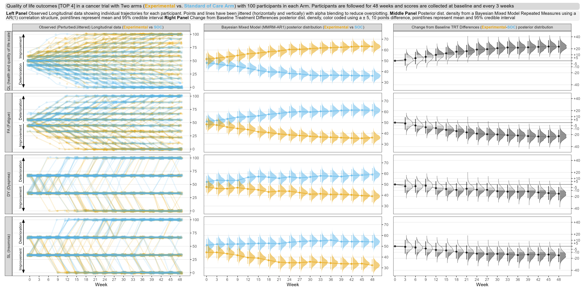
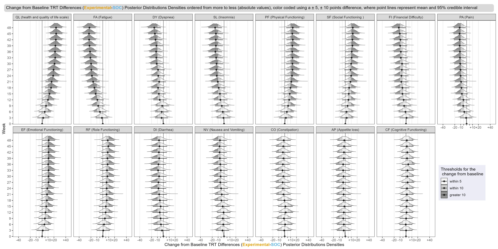

```{=html}
<style type="text/css">
.main-container {
max-width:    1200px;
margin-left:  auto;
margin-right: auto;}
.rt-compact .rt-td-inner{
padding: 0px 6px;
}
</style>
```

```{r knitr-defaults}
knitr::opts_chunk$set(warning = FALSE, message = FALSE, comment = NA)
knitr::opts_chunk$set(cache = FALSE)
options(width=170)
```

```{r load-packages}
pacman::p_load(tidyverse, rio)
pacman::p_load(ggdist, ggokabeito)
pacman::p_load(ggtext)
pacman::p_load(patchwork)
```

```{r import-reshape-label}
# import raw data
d1 <- import("dat/qlq-c30_data_l.rds") %>% 
   arrange(variable_name, USUBJID, AVISIT_N)

# import posterior data
d2 <- import("mod/qlq-c30_bayes.csv") %>%
   select(-Intercept, -Dispersion,  -LogLike,  -LogPost) %>%
   pivot_longer(cols = c(AVISIT_N0ARMExperimental:AVISIT_N48ARMStandard_of_Care)) %>%
   mutate(AVISIT_N = readr::parse_number(name),
          ARM = ifelse(str_detect(name,"Experimental"), "Experimental", "Standard_of_Care") %>%
             as.character()) %>%
   select(-name) %>%
   pivot_wider(names_from = ARM,
               values_from = value) %>%
   group_by(variable_name, Iteration) %>%
   mutate(Experimental_chg     = Experimental - Experimental[1],
          Standard_of_Care_chg = Standard_of_Care - Standard_of_Care[1]) %>%
   rowwise() %>%
   mutate(Difference     = Experimental - Standard_of_Care,
          Difference_chg = Experimental_chg - Standard_of_Care_chg) %>% 
   select(variable_name, Iteration, AVISIT_N, Experimental, Standard_of_Care, Difference, Difference_chg) %>% 
   pivot_longer(cols = c(Experimental, 
                         Standard_of_Care, 
                         Difference, 
                         Difference_chg)) %>% 
   ungroup()

# order abs value at 48 weeks
d_order <- d2 %>%
   filter(AVISIT_N == 48,
          name == "Difference_chg") %>%
   left_join( d1 %>% distinct(variable_name, variable_label) ) %>% 
   mutate( variable_combined = str_glue("{variable_name} ({variable_label})") ) %>% 
   group_by(variable_name, variable_label, variable_combined) %>%
   summarise(mean = mean(value)) %>%
   arrange(desc(abs(mean)))

# reshape raw data
d1 <- d1 %>% 
   mutate(variable_name  = factor(variable_name,  levels = d_order$variable_name),
          variable_label = factor(variable_label, levels = d_order$variable_label),
          variable_combined = str_glue("{variable_name} ({variable_label})") %>% 
             factor(levels = d_order$variable_combined))

# reshape posterior data
d2 <- d2 %>% 
   mutate(variable_name = factor(variable_name, levels = d_order$variable_name) )

# create arrows data
d3 <- d1 %>% 
   distinct(variable_name, variable_label, variable_combined) %>% 
   mutate(H = case_when(
      variable_name %in% c('QL', 'PF', 'RF', 'EF', 'CF', 'SF') ~ 'Improvement',
      TRUE                                                     ~ 'Deterioration'),
      L = ifelse(H == 'Improvement', 'Deterioration', 'Improvement')) %>% 
   pivot_longer(cols = c(H, L)) %>% 
   mutate(x = -3,
          y = ifelse(name == 'H', 75, 25))
```

```{r figure-1}
f1 <- ggplot(data = d1 %>% 
                filter(variable_name %in% d_order$variable_name[1:4]),
             aes(x = AVISIT_N,
                 y = value,
                 color = ARM,
                 group = USUBJID) ) +
   
   geom_point(position = position_jitter(width  = 0.75,
                                         height = 2,
                                         seed = 123),
              alpha = 0.15) +
   
   geom_line(position = position_jitter(width  = 0.75,
                                        height = 2,
                                        seed = 123),
             alpha = 0.15, lwd = 1.0) +
   
   scale_x_continuous(name = "Week",
                      breaks = unique(d1$AVISIT_N),
                      labels = unique(d1$AVISIT_N )) +
   
   scale_y_continuous(name = NULL,
                      position = 'right') +
   
   scale_color_okabe_ito(aesthetics = c("colour", "fill")) +
   
   facet_grid(variable_combined ~ 
                 'Observed (Perturbed/Jittered) Longitudinal data (<span style="color:#E69F00"><b>Experimental</b></span> vs <span style="color:#56B4E9"><b>SOC</b></span>)',
              switch = 'y') +
   
   coord_cartesian(ylim = c(-1, 101)) +
   
   theme_bw() +
   
   theme(panel.grid.minor   = element_blank(),
         panel.grid.major.x = element_blank(),
         strip.text.x = element_markdown() ) +
   
   guides(color = 'none') +
   
   geom_text(data = d3 %>% 
                filter(variable_name %in% d_order$variable_name[1:4]),
             aes(x = x,
                 y = y,
                 label = value,
                 color = NULL,
                 group = NULL),
             angle = 90,
             size = 3) + 
   
   annotate('segment', 
            arrow = arrow(angle = 20,
                          length = unit(0.05,"native"),
                          type = 'closed'),
            x = -2, xend = -2,
            y = 52, yend = 100) +
   
   annotate('segment', 
            arrow = arrow(angle = 20,
                          length = unit(0.05,"native"),
                          type = 'closed'),
            x = -2, xend = -2,
            y = 48, yend = 0)
```

```{r figure-2}
f2 <- ggplot(data = d2 %>% 
                filter(variable_name %in% d_order$variable_name[1:4]) %>% 
                filter(name %in% c("Experimental","Standard_of_Care")),
             aes(   x = AVISIT_N,
                    y = value,
                    fill = name,
                    color = name) )  +
   geom_line(data = . %>% 
                select(variable_name, AVISIT_N, name, value) %>% 
                group_by(variable_name, AVISIT_N, name) %>%
                summarise(m = mean(value)),
             aes(x = AVISIT_N      , 
                 y = m),
             size = 1,
             alpha = 0.50)  +
   stat_halfeye(
      position = position_dodge(width = .15),
      justification = -0.15,
      scale = 1.5,
      alpha = 0.50,
      point_interval = 'mean_qi',
      .width = c(0.95),
      interval_size = 1.5
   )+
   
   scale_x_continuous(name = "Week",
                      breaks = unique(d1$AVISIT_N),
                      labels = unique(d1$AVISIT_N),
                      expand = expansion(add = c(0, 2) ) ) +
   
   scale_y_continuous(name = NULL,
                      position = 'right') +
   
   scale_color_okabe_ito(aesthetics = c("colour", "fill")) +
   
   facet_grid(variable_name ~ 
                 'Bayesian Mixed Model (MMRM-AR1) posterior distribution (<span style="color:#E69F00"><b>Experimental</b></span> vs <span style="color:#56B4E9"><b>SOC</b></span>)',
              switch = 'y') +
   
   coord_cartesian(ylim = c(25, 75)) +
   
   theme_bw() +
   
   theme(panel.grid.minor   = element_blank(),
         panel.grid.major.x = element_blank(),
         strip.text.y = element_blank(),
         strip.text.x = element_markdown() ) +
   
   guides(fill = 'none',
          color = 'none')
```

```{r figure-3}
cut_pts = function(y, .width = c(5, 10)) {
   .width = sort(.width)
   cut(abs(y), 
       breaks = c(-Inf, .width, Inf), 
       labels = c(.width, Inf), 
       include.lowest = TRUE, 
       ordered_result = TRUE)}

f3 <- ggplot(data = d2 %>% 
                filter(variable_name %in% d_order$variable_name[1:4]) %>% 
                filter(name %in% c("Difference_chg")),
             aes(   x = AVISIT_N,
                    y = value,
                    fill = stat(cut_pts(y))
             ) 
)  +
   
   geom_line(data = . %>%
                select(variable_name, AVISIT_N, name, value) %>%
                group_by(variable_name, AVISIT_N, name) %>%
                summarise(m = mean(value)),
             aes(x = AVISIT_N      ,
                 y = m),
             size = 1,
             color = 'gray50',
             alpha = 0.50)  +
   
   geom_hline(yintercept = 0, color = 'gray50') +
   
   stat_halfeye(
      justification = -0.15,
      color = "black",
      slab_color = 'black',
      slab_size = 0.25,
      scale = 0.70,
      alpha = 0.70,
      point_interval = 'mean_qi',
      .width = c(0.95),
      interval_size = 1.5,
      p_limits = c(0.01, 0.99)
   ) +
   
   scale_x_continuous(name = "Week",
                      breaks = unique(d1$AVISIT_N),
                      labels = unique(d1$AVISIT_N ),
                      expand = expansion(add = c(0.5, 0.25) ) ) +
   
   scale_y_continuous(name = NULL,
                      breaks = c(-40, -20, -10, -5, 0, 5, 10, 20, 40),
                      labels = c('-40', '-20', '-10', '-5', '', '+5', '+10', '+20', '+40'),
                      position = 'right') +
   
   scale_fill_brewer(type = 'seq ',
                     palette = 'Greys') +
   
   facet_grid(variable_name ~
                 'Change from Baseline TRT Differences (<span style="color:#E69F00"><b>Experimental</b></span>-<span style="color:#56B4E9"><b>SOC</b></span>) posterior distribution',
              switch = 'y') +
   
   coord_cartesian(ylim = c(-45, 45)) +
   
   theme_bw() +
   
   theme(panel.grid.minor   = element_blank(),
         panel.grid.major.x = element_blank(),
         strip.text.y = element_blank(),
         strip.text.x = element_markdown() ) +
   
   guides(fill = 'none')
```

```{r figure-combine}
f_comb <- f1 + f2 + f3 +
   plot_annotation( 
      title    = 'Quality of life outcomes [TOP 4] in a cancer trial
   with Two arms (<span style="color:#E69F00"><b>Experimental</b></span> vs. <span style="color:#56B4E9"><b>Standard of Care Arm</b></span>)
   with 100 participants in each Arm. Participants are followed for 48 weeks and scores are collected at baseline and every 3 weeks',
   subtitle =
      '**Left Panel** Observed Longitudinal data showing individual trajectories for each participant. Points and lines have been jittered (horizontally and vertically) with alpha blending to reduce overplotting.
      **Middle Panel** Posterior dist. density from a Bayesian Mixed Model Repeated Measures using a AR(1) correlation structure, point/lines represent mean and 95% credible interval
      **Right Panel** Change from Baseline Treatment Differences posterior dist. density, color coded using a ± 5, 10 points difference, point/lines represent mean and 95% credible interval',
   #caption  = '**Data from Wonderful-Wednesdays** <span style="font-size:8pt">github.com/VIS-SIG[2022−03−09]</span>',
   theme = theme(plot.title.position = "plot",
                 plot.title = element_textbox_simple(
                    size = 11,
                    lineheight = 1,
                    r = unit(5, "pt"),
                    padding = margin(3, 3, 3, 3),
                    margin = margin(1, 1, 1, 1),
                    fill = "gray85"
                 ),
                 #plot.subtitle.position = "plot",
                 plot.subtitle = element_textbox_simple(
                    size = 10,
                    lineheight = 1,
                    r = unit(5, "pt"),
                    padding = margin(2, 2, 2, 2),
                    margin = margin(1, 1, 1, 1),
                    fill = "gray95"
                 ),
                 plot.caption  = element_markdown()) )

ggsave(filename = 'fig/qlq-c30_fig_comb.png',
       plot = f_comb,
       height = 8,
       width = 16,
       scale = 1.15,
       dpi = 300,
       units = 'in')
```       


# VISUALIZATIONS [TOP 4]
```{r out.width='100%'}

```


```{r figure-change}
d4 <- d2 %>% 
   left_join( d1 %>% distinct(variable_name, variable_label, variable_combined) )

cut_pts = function(y, .width = c(5, 10)) {
   .width = sort(.width)
   cut(abs(y),
       breaks = c(-Inf, .width, Inf),
       labels = c(.width, Inf),
       include.lowest = TRUE,
       ordered_result = TRUE)
}

f_chg <- ggplot(data = d4 %>%
                   filter(name %in% c("Difference_chg")),
                aes(   y = AVISIT_N,
                       x = value,
                       fill = stat(cut_pts(x)))) +
   
   geom_line(data = . %>%
                select(variable_combined , AVISIT_N, value) %>%
                group_by(variable_combined, AVISIT_N) %>%
                summarise(m = mean(value)),
             aes(y = AVISIT_N,
                 x = m),
             orientation = 'y',
             size = 1,
             color = 'gray50',
             alpha = 0.50)  +
   
   geom_vline(xintercept = 0, color = 'gray50') +
   
   stat_halfeye(orientation = 'y',
                justification = -0.15,
                color = "black",
                slab_color = 'black',
                slab_size = 0.25,
                scale = 0.70,
                alpha = 0.70,
                point_interval = 'mean_qi',
                .width = 0.95,
                interval_size = 1.5,
                p_limits = c(0.01, 0.99)
   ) +
   
   scale_fill_brewer(name = "Thresholds for the \n change from baseline",
                     type = 'seq ',
                     palette = 'Greys',
                     labels = c('within 5','within 10','greater 10')
   ) +
   
   scale_y_continuous(name = "Week",
                      breaks = unique(d4$AVISIT_N),
                      labels = unique(d4$AVISIT_N ),
                      expand = expansion(add = c(0.2, 0.2) ) ) +
   
   scale_x_continuous(name = 'Change from Baseline TRT Differences (<span style="color:#E69F00"><b>Experimental</b></span>-<span style="color:#56B4E9"><b>SOC</b></span>) Posterior Distributions Densities',
                      breaks = c(-40, -20, -10, -5, 0, 5, 10, 20, 40),
                      labels = c('-40', '-20', '-10', '', '', '', '+10', '+20', '+40')
   ) +
   
   facet_wrap(~ variable_combined , nrow = 2) +
   
   coord_cartesian(xlim = c(-45, 45)) +
   
   labs(
      title = 'Change from Baseline TRT Differences (<span style="color:#E69F00"><b>Experimental</b></span>-<span style="color:#56B4E9"><b>SOC</b></span>) Posterior Distributions Densities ordered from more to less (absolute values), color coded using a ± 5, ± 10 points difference, where point lines represent mean and 95% credible interval'
   ) +
   
   theme_bw() +
   
   theme(panel.grid.minor   = element_blank(),
         panel.grid.major.y = element_blank(),
         axis.title.x = element_markdown(),
         legend.position = c(.93, .25),
         legend.background = element_rect('#EBECF5')
   )  +
   
   theme(plot.title.position = "plot",
         plot.title = element_textbox_simple(
            size = 11,
            lineheight = 1,
            r = unit(5, "pt"),
            padding = margin(5, 5, 5, 5),
            margin = margin(5, 5, 5, 5),
            fill = "gray85"
         )
   )

ggsave(filename = 'fig/qlq-c30_fig_chg.png',
       plot = f_chg,
       height = 8,
       width = 16,
       scale = 1.1,
       dpi = 300,
       units = 'in')
```

# CHANGE FROM BASELINE [ALL]
```{r}

```


# (QL) health and quality of life scale {data-navmenu="QUALITY OF LIFE"}
```{r, fig.height = 8, fig.width = 16, dpi = 150}
g <- function(var = "QL") {
   
   f1 <- ggplot(data = d1 %>% 
                   filter(variable_name %in% var),
                aes(x = AVISIT_N,
                    y = value,
                    color = ARM,
                    group = USUBJID) ) +
      
      geom_point(position = position_jitter(width  = 0.75,
                                            height = 2,
                                            seed = 123),
                 alpha = 0.15) +
      
      geom_line(position = position_jitter(width  = 0.75,
                                           height = 2,
                                           seed = 123),
                alpha = 0.15, lwd = 1.0) +
      
      scale_x_continuous(name = "Week",
                         breaks = unique(d1$AVISIT_N),
                         labels = unique(d1$AVISIT_N )) +
      
      scale_y_continuous(name = NULL,
                         position = 'right') +
      
      scale_color_okabe_ito(aesthetics = c("colour", "fill")) +
      
      facet_grid(variable_combined ~ 
                    'Observed (Perturbed/Jittered) Longitudinal data (<span style="color:#E69F00"><b>Experimental</b></span> vs <span style="color:#56B4E9"><b>SOC</b></span>)',
                 switch = 'y') +
      
      coord_cartesian(ylim = c(-1, 101)) +
      
      geom_text(data = d3 %>% 
                   filter(variable_name %in% var),
                aes(x = x,
                    y = y,
                    label = value,
                    color = NULL,
                    group = NULL),
                angle = 90,
                size = 3) + 
      
      annotate('segment', 
               arrow = arrow(angle = 20,
                             length = unit(0.03,"native"),
                             type = 'closed'),
               x = -2, xend = -2,
               y = 52, yend = 100) +
      
      annotate('segment', 
               arrow = arrow(angle = 20,
                             length = unit(0.03,"native"),
                             type = 'closed'),
               x = -2, xend = -2,
               y = 48, yend = 0)
   
   f2 <- ggplot(data = d2 %>% 
                   filter(variable_name %in% var) %>% 
                   filter(name %in% c("Experimental","Standard_of_Care")),
                aes(   x = AVISIT_N,
                       y = value,
                       fill = name,
                       color = name) )  +
      geom_line(data = . %>% 
                   select(variable_name, AVISIT_N, name, value) %>% 
                   group_by(variable_name, AVISIT_N, name) %>%
                   summarise(m = mean(value)),
                aes(x = AVISIT_N      , 
                    y = m),
                size = 1,
                alpha = 0.50)  +
      stat_halfeye(
         position = position_dodge(width = .15),
         justification = -0.15,
         scale = 1.5,
         alpha = 0.50,
         point_interval = 'mean_qi',
         .width = c(0.95),
         interval_size = 1.5
      )+
      
      scale_x_continuous(name = "Week",
                         breaks = unique(d1$AVISIT_N),
                         labels = unique(d1$AVISIT_N),
                         expand = expansion(add = c(0, 2) ) ) +
      
      scale_y_continuous(name = NULL,
                         position = 'right') +
      
      scale_color_okabe_ito(aesthetics = c("colour", "fill")) +
      
      facet_grid(variable_name ~ 
                    'Bayesian Mixed Model (MMRM-AR1) Posterior Dist. (<span style="color:#E69F00"><b>Experimental</b></span> vs <span style="color:#56B4E9"><b>SOC</b></span>)',
                 switch = 'y') +
      
      coord_cartesian(ylim = c(25, 75)) +
      
      theme(strip.text.y = element_blank())
   
   
   cut_pts = function(y, .width = c(5, 10)) {
      .width = sort(.width)
      cut(abs(y), 
          breaks = c(-Inf, .width, Inf), 
          labels = c(.width, Inf), 
          include.lowest = TRUE, 
          ordered_result = TRUE)}
   
   f3 <- ggplot(data = d2 %>% 
                   filter(variable_name %in% var) %>% 
                   filter(name %in% c("Difference_chg")),
                aes(   x = AVISIT_N,
                       y = value,
                       fill = stat(cut_pts(y))
                ) 
   )  +
      
      geom_line(data = . %>%
                   select(variable_name, AVISIT_N, name, value) %>%
                   group_by(variable_name, AVISIT_N, name) %>%
                   summarise(m = mean(value)),
                aes(x = AVISIT_N      ,
                    y = m),
                size = 1,
                color = 'gray50',
                alpha = 0.50)  +
      
      geom_hline(yintercept = 0, color = 'gray50') +
      
      stat_halfeye(
         justification = -0.15,
         color = "black",
         slab_color = 'black',
         slab_size = 0.25,
         scale = 0.70,
         alpha = 0.70,
         point_interval = 'mean_qi',
         .width = c(0.95),
         interval_size = 1.5,
         p_limits = c(0.01, 0.99)
      ) +
      
      scale_x_continuous(name = "Week",
                         breaks = unique(d1$AVISIT_N),
                         labels = unique(d1$AVISIT_N ),
                         expand = expansion(add = c(0.5, 0.25) ) ) +
      
      scale_y_continuous(name = NULL,
                         breaks = c(-40, -20, -10, -5, 0, 5, 10, 20, 40),
                         labels = c('-40', '-20', '-10', '-5', '', '+5', '+10', '+20', '+40'),
                         position = 'right') +
      
      scale_fill_brewer(type = 'seq ',
                        palette = 'Greys') +
      
      facet_grid(variable_name ~
                    'Change from Baseline TRT Differences (<span style="color:#E69F00"><b>Experimental</b></span>-<span style="color:#56B4E9"><b>SOC</b></span>) Posterior Dist.',
                 switch = 'y') +
      
      coord_cartesian(ylim = c(-45, 45))  +
      
      theme(strip.text.y = element_blank())
   
   
   
   f_comb <- f1 + f2 + f3 &
      (theme_bw() +
          theme(panel.grid.minor   = element_blank(),
                strip.text.x = element_markdown(),
                legend.position="none")
      )
   
   print(f_comb)
   
}

g(var = "QL")
```

# (PF) Physical Functioning {data-navmenu="FUNCTIONAL"}
```{r, fig.height = 8, fig.width = 16, dpi = 120}
g(var = "PF")
```

# (RF) Role Functioning {data-navmenu="FUNCTIONAL"}
```{r, fig.height = 8, fig.width = 16, dpi = 120}
g(var = "RF")
```

# (EF) Emotional Functioning {data-navmenu="FUNCTIONAL"}
```{r, fig.height = 8, fig.width = 16, dpi = 120}
g(var = "EF")
```

# (CF) Cognitive Functioning {data-navmenu="FUNCTIONAL"}
```{r, fig.height = 8, fig.width = 16, dpi = 120}
g(var = "CF")
```

# (SF) Social Functioning {data-navmenu="FUNCTIONAL"}
```{r, fig.height = 8, fig.width = 16, dpi = 120}
g(var = "SF")
```


# Fatigue (FA) {data-navmenu="SYMPTOMS"}
```{r, fig.height = 8, fig.width = 16, dpi = 120}
g(var = "FA")
```

# Nausea and Vomiting (NV) {data-navmenu="SYMPTOMS"}
```{r, fig.height = 8, fig.width = 16, dpi = 120}
g(var = "NV")
```

# Pain (PA) {data-navmenu="SYMPTOMS"}
```{r, fig.height = 8, fig.width = 16, dpi = 120}
g(var = "PA")
```

# Dyspnea (DY) {data-navmenu="SYMPTOMS"}
```{r, fig.height = 8, fig.width = 16, dpi = 120}
g(var = "DY")
```

# Insomnia (SL) {data-navmenu="SYMPTOMS"}
```{r, fig.height = 8, fig.width = 16, dpi = 120}
g(var = "SL")
```

# Appetite loss (AP) {data-navmenu="SYMPTOMS"}
```{r, fig.height = 8, fig.width = 16, dpi = 120}
g(var = "AP")
```

# Constipation (CO) {data-navmenu="SYMPTOMS"}
```{r, fig.height = 8, fig.width = 16, dpi = 120}
g(var = "CO")
```

# Diarrhea (DI) {data-navmenu="SYMPTOMS"}
```{r, fig.height = 8, fig.width = 16, dpi = 120}
g(var = "DI")
```


# (FI) Financial Difficulty {data-navmenu="FINANCIAL DIFFICULTY"}
```{r, fig.height = 8, fig.width = 16, dpi = 120}
g(var = "FI")
```
